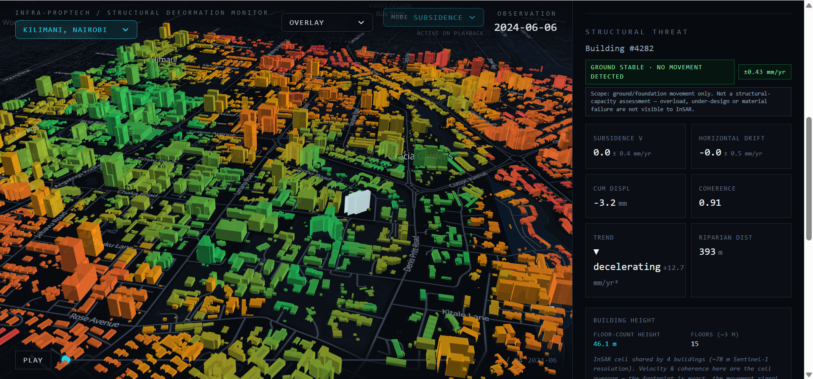
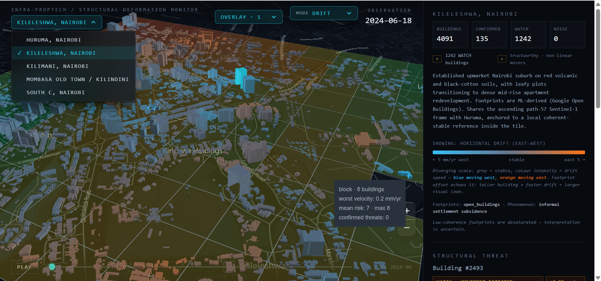
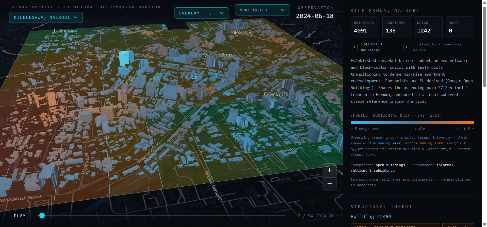
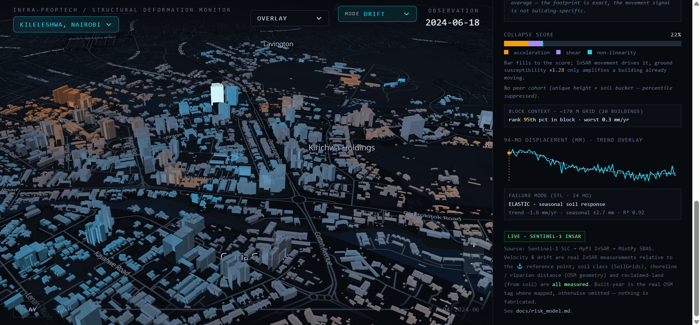

# InSAR-Final — Building-Subsidence Threat Monitor (Nairobi)

A satellite-radar (InSAR) monitoring system that surfaces buildings at risk of
ground-movement-driven structural distress across five Nairobi/Mombasa
neighborhoods. It fuses Sentinel-1 InSAR deformation velocities with soil class,
riparian/shoreline distance, building height/load, and an angular-distortion
(differential-settlement) term into a single, explainable **collapse score** and
an absolute **danger tier** — then ranks the worst buildings first for a human
reviewer.

> **Honest framing.** Per-building InSAR in dense, informal settlements is noisy
> (decorrelation on iron-sheet roofs, sub-pixel buildings, construction churn).
> The system classifies **threat to occupants** (act now / soon / later), not
> data quality, and it gates every classification behind a coherence + linear-
> trend defensibility test. It is a screening/triage tool to direct inspection,
> **not** a predictive collapse model — that needs construction-quality data the
> radar cannot see.

---

## Screenshots

| Idle risk map | Velocity story (time slider) |
|---|---|
|  |  |

| Drift Map  | Building detail + confidence |
|---|---|
|  |  |

| WATCH / mixed-signal cohort | AOI overview |
|---|---|
|  |  |


---

## How the system works

### 1. Data acquisition (build-time only)
Sentinel-1 SAR scenes are searched with `asf_search`, interferograms are
processed on ASF **HyP3**, and stacks are time-series-inverted with **MintPy**.
This happens offline, ahead of any demo — the running app never touches the
network.

```
asf_search  →  HyP3 (interferograms)  →  MintPy (time-series velocity)
            →  reproject / clip to common grid  →  GeoParquet  →  DuckDB
```

Key pipeline scripts (`backend/scripts/`):
- `aois.py` — area-of-interest definitions (bbox, tracks, anchor flags).
- `hyp3_pipeline.py`, `osl_fetch_hyp3.py` — order and pull interferograms.
- `mintpy_run.py` — time-series inversion and velocity estimation.
- `reproject_hyp3.py`, `clip_to_common_grid.py` — align ASC/DESC stacks to one grid.
- `decompose.py` — decompose ascending+descending into vertical / east-west motion.
- `fetch_gacos.py` — GACOS atmospheric correction.
- `fetch_env_context.py` — soil, shoreline, riparian, reclaimed-land context.
- `open_buildings_footprints.py`, `osm_footprints.py` — building footprints.
- `join_insar.py`, `postprocess.py` — join InSAR pixels to buildings, score them.
- `seed_synthetic.py` — generate a plausible synthetic dataset for a dry run.

### 2. Scoring (the collapse score)
For each building the pipeline computes a **movement-dominant composite score**
and an absolute **danger tier**. Inputs and guards:

- **Deformation velocity** (mm/yr), de-meaned per AOI to remove common-mode /
  atmospheric drift.
- **Defensibility gate** — a pixel is only trusted if coherence (γ) is high
  **and** the displacement is a genuine linear trend (`trend_r2`). High-γ but
  non-linear pixels are surfaced as **WATCH**, not buried.
- **Angular distortion / tilt** — a velocity-gradient term across each footprint
  (differential settlement is what actually cracks structures). This is
  **escalate-only**: InSAR can't resolve true building-scale tilt, so it can
  raise a flag but never lowers a score.
- **Environmental context** — soil class, distance to river/shoreline,
  reclaimed-land flag.
- **Load proxy** — building height (imputed safely when unknown) and footprint.
- **Confidence-scaled shear** — uncertain pixels contribute less.

Output tiers map to occupant action: **Act now / Soon / Later / Watch /
Insufficient evidence**. See `docs/risk_model.md` and `docs/Ref_One.md`.

### 3. API (FastAPI + DuckDB)
A single read-only FastAPI process serves a DuckDB file (`backend/app/main.py`):

| Endpoint | Purpose |
|---|---|
| `GET /health` | Liveness check |
| `GET /aois` | List areas of interest |
| `GET /aoi/{code}/bundle` | Pre-baked binary bundle for fast frontend load |
| `GET /buildings` | Buildings in a bbox |
| `GET /buildings/at-date` | Building states at a given date (time slider) |
| `GET /buildings/{id}/timeseries` | Per-building displacement time series |
| `GET /risk-summary` | AOI-level threat counts |

### 4. Frontend (MapLibre + deck.gl)
A React + TypeScript app (`frontend/src/`) renders footprints as data-driven
extrusions over an offline PMTiles basemap:

- `RiskMap.tsx` — MapLibre GL + deck.gl polygon/extrusion layer.
- `ThreatSidebar.tsx` — worst-first building list, confidence pills, WATCH toggle.
- `TimeSlider.tsx` — scrub/play the deformation story over ~24 months.
- `TopBar.tsx` — AOI picker and legend.

At idle the map paints the **composite-risk percentile** (green → red). Pressing
play switches to the **velocity story**; the legend switches with it.

---

## Areas of interest

Five neighborhoods are processed on real Sentinel-1 InSAR:

- **Huruma**, Nairobi (informal settlement)
- **South C**, Nairobi
- **Kileleshwa**, Nairobi
- **Kilimani**, Nairobi
- **Mombasa** Old Town / Kilindini (coastal subsidence)

---

## Repository layout

```
backend/
  app/main.py            FastAPI service (read-only DuckDB)
  scripts/               InSAR pipeline + scoring + env-context fetchers
  tests/                 pytest suite (invariants + scoring)
  data/                  schema + provenance (large data dirs are git-ignored)
  requirements.txt
  ARCHITECTURE_*.md      design notes
frontend/
  src/components/        RiskMap, ThreatSidebar, TimeSlider, TopBar
  src/lib/               data bundle + AOI hooks
  public/tiles/          PMTiles basemap (git-ignored)
docs/                    risk_model, plans, runbooks
screenshots/             README images
```

> **Note on data.** The large InSAR / geospatial artifacts (HyP3 work dirs,
> MintPy stacks, raw downloads, `demo.duckdb`, parquet) are **not** committed —
> they are regenerable from the pipeline and exceed GitHub's file limits. See
> `.gitignore`.

---

## Quickstart

```bash
# 1. Backend — seed a synthetic dataset and serve the API
cd backend
python -m venv .venv && source .venv/bin/activate
pip install -r requirements.txt
python -m backend.scripts.seed_synthetic        # plausible synthetic data (~10s)
uvicorn backend.app.main:app --port 8000

# 2. Frontend
cd ../frontend
npm install
npm run dev                                      # http://localhost:5173
```

The UI boots on a flat dark canvas without a basemap. To install an offline
PMTiles extract covering the AOIs:

```bash
cd frontend
npm run fetch:pmtiles        # installs pmtiles CLI locally, writes public/tiles/nairobi.pmtiles
```

### Running the real InSAR pipeline
The pipeline scripts in `backend/scripts/` produce GeoParquet with the same
schema as the seeder, so the DuckDB schema (`backend/scripts/init_db.sql`) and
the app load identically whether the data is synthetic or real. See
`docs/opensarlab_runbook.md` and `docs/insar_alignment_plan.md`.

---

## Tech stack

| Layer | Choice |
|---|---|
| Basemap | MapLibre GL JS + PMTiles (fully offline) |
| 3D viz | deck.gl polygon/extrusion over MapLibre |
| Backend | FastAPI (single process) |
| Store | DuckDB + `spatial` extension + GeoParquet |
| Pipeline | `asf_search` → HyP3 → MintPy → GACOS, build-time only |
| Frontend | React + TypeScript + Vite + Tailwind |

PostGIS is the right answer at city scale; for this laptop-scale MVP, DuckDB
files ship with zero install.

---

## Tests

```bash
cd backend && pytest
```

The suite checks scoring invariants and the defensibility gate. Some tests skip
when an AOI is synthetic-only.
